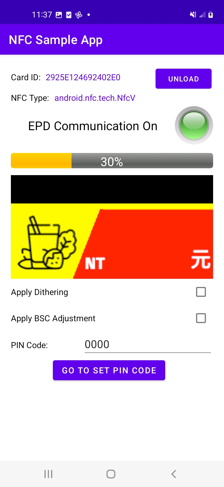
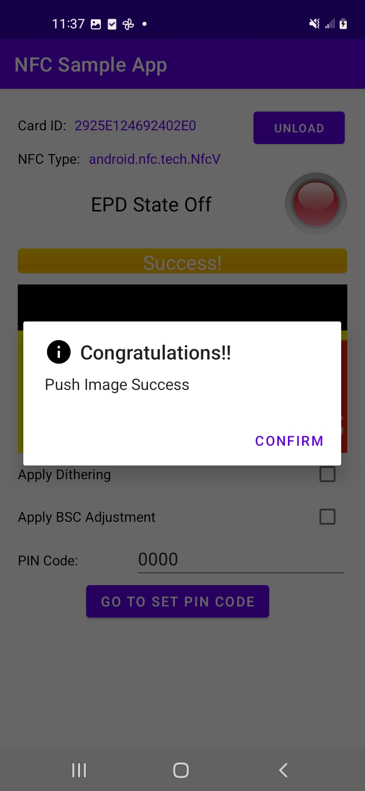
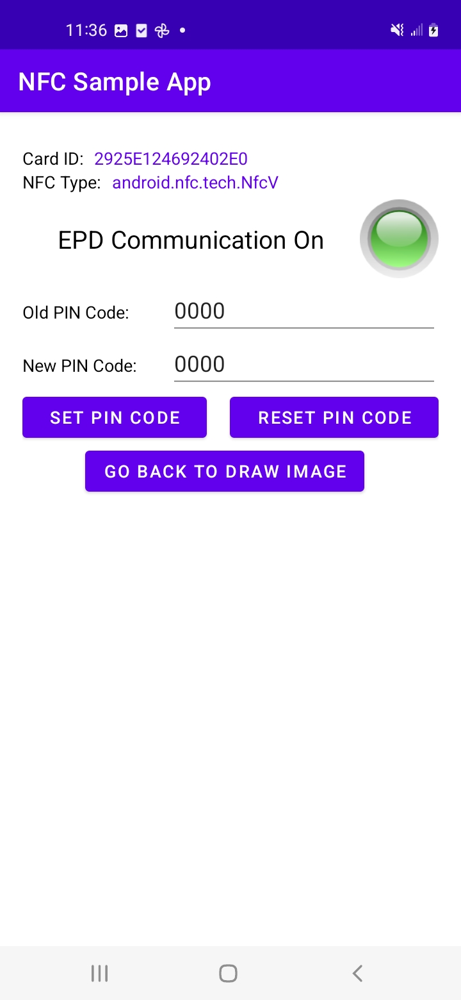

# nfclib

### Overview
This is an Android NFC library for communication with Advantech ePaper (EPD) devices.

### Gradle
**Step 1.** Add the JitPack repository to your build file. 
* For users with Gradle version < 6.8
* Add it in your root build.gradle at the end of repositories:
```java=
allprojects {
    repositories {
        ...
        maven { url 'https://jitpack.io' }
    }
}
```
* For users with Gradle version >= 6.8
* Add it in your root setting.gradle at the end of repositories:
```java=
dependencyResolutionManagement {
    repositoriesMode.set(RepositoriesMode.FAIL_ON_PROJECT_REPOS)
    repositories {
        ...
        maven { url 'https://jitpack.io' }
    }
}
```

**Step 2.** Add the dependency. 
[Tag] must be replaced as the specific version, such as [1.1.0].
```java=
dependencies {
    implementation 'com.github.fabian415:nfclib:Tag'
}
```

### Maven
**Step 1.** Add the JitPack repository to your build file.
```xml=
<repositories>
    <repository>
        <id>jitpack.io</id>
        <url>https://jitpack.io</url>
    </repository>
</repositories>
```

**Step 2.** Add the dependency. 
[Tag] must be replaced as the specific version, such as [1.1.0].
```xml=
<dependency>
    <groupId>com.github.fabian415</groupId>
    <artifactId>nfclib</artifactId>
    <version>Tag</version>
</dependency>
```

### JavaDoc
https://fabian415.github.io/nfclib/

### Source Code
You can download this sample project from the following link:
https://github.com/fabian415/nfclib.git

* Main Activity Page


* Push Image Success


* Pin Activity Page



### Preparation
* **IDE tool:** Android Studio 2021.3.1 or higher
* **Language:** Java
* **EPD Devices:** Advantech EPD-210 / EPD-302 / EPD-303 / EPD-304 Card

### Basic Usage
#### Step Index
* Step 1 ~ 5. **NFC Manager** and **NFC Adapter** initilization
* Step 6. Assign an NFC tag to NFC Manager.
* Step 7. Unlock PIN code and send the draw image command
* Step 8. Reset NFC state
* Step 9. Set a new PIN code
* Step 10. Reset PIN code

#### **Step 1.** Setup the Manifest.xml file.
Within your **Manifest.xml**, you must provide the `user-permission` for the usage of mobile NFC sensor. In addition, you also need to add the `<intent-filter>` elements with NFC-related actions to specify that your app can handle certain NFC events. These intent filters inform the Android system that your app is capable of processing NFC tags when they are discovered.

Manifest.xml
```xml=
<?xml version="1.0" encoding="utf-8"?>
<manifest xmlns:android="http://schemas.android.com/apk/res/android"
    xmlns:tools="http://schemas.android.com/tools"
    package="com.advantech.nfcsampleapp">
    
    <!-- normal permission for NFC Tag -->
    <uses-permission android:name="android.permission.NFC" />
    <!-- hardware requirement for NFC -->
    <uses-feature android:name="android.hardware.nfc" android:required="true" />

    <application
        android:allowBackup="true"
        android:dataExtractionRules="@xml/data_extraction_rules"
        android:fullBackupContent="@xml/backup_rules"
        android:icon="@mipmap/ic_launcher"
        android:label="@string/app_name"
        android:roundIcon="@mipmap/ic_launcher_round"
        android:supportsRtl="true"
        android:theme="@style/Theme.NFCSampleApp"
        tools:targetApi="31">
        <activity
            android:name=".MainActivity"
            android:exported="true">
            <intent-filter>
                <action android:name="android.intent.action.MAIN" />
                <category android:name="android.intent.category.LAUNCHER" />
                
                <!-- intent filters indicate that this app can process NFC tags  -->
                <action android:name="android.nfc.action.TECH_DISCOVERED" />
                <action android:name="android.nfc.action.NDEF_DISCOVERED" />
                <action android:name="android.nfc.action.TAG_DISCOVERED" />
            </intent-filter>
        </activity>
    </application>

</manifest>
```

#### **Step 2.** Initiate an NFC Manager
Within the **onCreate** method of MainActivity, you need to initiate an `NFC Manager`. This NFC Manager provides utility functions that can assist you to perform NFC communication with EPD cards. 

MainActivity.java
```java=
...
// nfc manager
private NFCManager manager;
...

@Override
protected void onCreate(Bundle savedInstanceState) {
    ...
    context = this;

    // initiate an NFC Manager instance
    manager = NFCManager.getInstance();
    ...
}
```

#### **Step 3.** Register and implement NFC Tag Change Listener and Draw Image Callback
Within the **onCreate** method of MainActivity, assign the `NFC Tag Change Listener` and `Draw Image Listener` to this activity. In addition, this activity also need to implement `NFCManager.NFCTagChangeListener` and  `NfcEPDAPI.DrawImageCallback` interface. Then, this activity must override two callback functions which will trigger upon the detection of an NFC tag ( **onTagStateChange**) or the initiation of the image transmission process ( **onProgress**), respectively. 

MainActivity.java
```java=
public class MainActivity extends AppCompatActivity implements NFCManager.NFCTagChangeListener, NfcEPDAPI.DrawImageCallback {

    ...
    // nfc manager
    private NFCManager manager;
    ...

    @Override
    protected void onCreate(Bundle savedInstanceState) {
        ...
        context = this;

        // initiate an NFC Manager instance
        manager = NFCManager.getInstance();

        // assign NFC change tag listener and draw image listener to this activity
        manager.addChangeTagListener(this);
        manager.setDrawImageListener(this);
        ...
    }
    
    @Override
    public void onTagStateChange(NFCManager.NFCTagState state) {
        // Tag State Changed Callback
        ...
        switch (state) {
            case NFC_TAG_STATE_TAG_OFF:
                ivLed.setImageResource(R.drawable.red_led);
                tvNotion.setText("EPD State Off");
                break;
            case NFC_TAG_STATE_TAG_ON:
                ivLed.setImageResource(R.drawable.yellow_led);
                tvNotion.setText("EPD State On");
                break;
            case NFC_TAG_STATE_COMM_ON:
                // When EPD tag communication is ready, you can send the draw image command.
                ivLed.setImageResource(R.drawable.green_led);
                tvNotion.setText("EPD Communication On");
                drawImage();
                break;
        }
    }
    
    @Override
    public void onProgress(NfcEPDAPI.DrawImageState state, Object data) {
        // Draw Image Results Callback
        switch (state) {
            case DIState_Erase: {
                Log.e(TAG, "onProgress:  DIState_Erase ["+System.currentTimeMillis()+"]");
                ...
            }
            break;
                
            case DIState_SendData: {
                final int percent = ((int) data == 100) ? 99: (int) data;
                ...
            }
            break;

            case DIState_Error: {
                // Reset NFC state, drive MCU to reboot
                manager.resetNFCState();
                ...
            }
            break;

            case DIState_Finish: {
                Log.e(TAG, "onProgress:  DIState_Finish ["+System.currentTimeMillis()+"]");
                // Reset NFC state, drive MCU to reboot
                manager.resetNFCState();
                final int percent = 100;
                ...
            }
            break;
        }
    }
}
```

#### **Step 4.** Create an NfcAdapter instance
Within the **onCreate** method of MainActivity, create an `NfcAdapter` instance and prepare a pending intent and intent filters. Then, you need to override **onNewIntent** method because when an NFC tag is scanned, the system sends an Intent to the foreground activity. Advantech NFC cards only support NFC technology type: **"android.nfc.tech.NfcV"**, which is a string constant used to identify NFC tags that conform to the ISO/IEC 15693 standard. After NfcV tag is discovered, you can assign this NFC tag to NFC manager.

MainActivity.java
```java=
public class MainActivity extends AppCompatActivity implements NFCManager.NFCTagChangeListener, NfcEPDAPI.DrawImageCallback {

    ...
    // nfc manager
    private NFCManager manager;
    ...

    @Override
    protected void onCreate(Bundle savedInstanceState) {
        ...
        context = this;

        // initiate an NFC Manager instance
        manager = NFCManager.getInstance();

        // assign NFC change tag listener and draw image listener to this activity
        manager.addChangeTagListener(this);
        manager.setDrawImageListener(this);
        ...
            
        // Create an NfcAdapter instance
        nfcAdapter = NfcAdapter.getDefaultAdapter(this);
        if (nfcAdapter == null) {
            Toast.makeText(this, "This device does not support NFC", Toast.LENGTH_SHORT).show();
            finish();
            return;
        }

        // Prepare a pending intent and intent Filters
        pendingIntent = PendingIntent.getActivity(this, 0, new Intent(this, this.getClass()).addFlags(Intent.FLAG_ACTIVITY_SINGLE_TOP), PendingIntent.FLAG_MUTABLE);
        IntentFilter tagDetected = new IntentFilter(NfcAdapter.ACTION_TAG_DISCOVERED);
        tagDetected.addCategory(Intent.CATEGORY_DEFAULT);
        writingTagFilters = new IntentFilter[]{ tagDetected, new IntentFilter(NfcAdapter.ACTION_TECH_DISCOVERED), new IntentFilter(NfcAdapter.ACTION_NDEF_DISCOVERED)};
        mTechListsArray = null;    
    }
    
    @Override
    protected void onNewIntent(Intent intent) {
        super.onNewIntent(intent);
        setIntent(intent);
        
        // When NFC tag is detected.
        String action = intent.getAction();
        if (NfcAdapter.ACTION_TECH_DISCOVERED.equals(action) || NfcAdapter.ACTION_TAG_DISCOVERED.equals(action)) {
            // Read a tech tag
            Tag myTag = intent.getParcelableExtra(NfcAdapter.EXTRA_TAG);
            String[] techList = myTag.getTechList();
            if(techList != null && techList.length > 0) {
                String type = techList[0];
                if ("android.nfc.tech.NfcV".equals(type)) {
                    // Set a new tag to NFC Manager
                    manager.setTag(myTag);
                } else {                          
                    Toast.makeText(this, "NFC type is wrong. Please try to scan it again.", Toast.LENGTH_LONG).show();
                    // Reset NFC state, drive MCU to reboot
                    manager.resetNFCState();
                }
            }
        }
    }
}
```

#### **Step 5.** Start listening NFC tags
Within the **onResume** method of MainActivity, sets up the activity to listen for NFC tags when it is in the foreground by using `enableForegroundDispatch` method. In addition, within the **onPause** method of MainActivity, apply `disableForegroundDispatch` method to disable the foreground dispatch system, stopping the activity from receiving NFC events when it is not in the foreground.

MainActivity.java
```java=
    @Override
    protected void onResume() {
        super.onResume();
        if (nfcAdapter != null) {
            if (!nfcAdapter.isEnabled()) {
                Toast.makeText(this, "You need to enable NFC first!", Toast.LENGTH_SHORT).show();
                return;
            }
            
            // Start listening NFC devices
            nfcAdapter.enableForegroundDispatch(this, pendingIntent, writingTagFilters, mTechListsArray);
        }
    }

    @Override
    protected void onPause() {
        super.onPause();
        
        // Stop listening NFC devices
        nfcAdapter.disableForegroundDispatch(this);
    }
```

#### **Step 6.** Assign an NFC tag to NFC Manager. 
After NfcV tag is discovered, you can assign this NFC tag to NFC manager by using `manager.setTag()` method.

MainActivity.java
```java=
@Override
    protected void onNewIntent(Intent intent) {
        super.onNewIntent(intent);
        setIntent(intent);
        
        // When NFC tag is detected.
        String action = intent.getAction();
        if (NfcAdapter.ACTION_TECH_DISCOVERED.equals(action) || NfcAdapter.ACTION_TAG_DISCOVERED.equals(action)) {
            // Read a tech tag
            Tag myTag = intent.getParcelableExtra(NfcAdapter.EXTRA_TAG);
            String[] techList = myTag.getTechList();
            if(techList != null && techList.length > 0) {
                String type = techList[0];
                if ("android.nfc.tech.NfcV".equals(type)) {
                    // Set a new tag to NFC Manager
                    manager.setTag(myTag);
                }
            }
        }
    }
```

##### **Step 7.** Unlock PIN code and send the draw image command. 
When an EPD tag communication is ready, you can unlock PIN code by using `manager.unlockPINCode()` method and then display an image by using `manager.drawImage()` method.

MainActivity.java
```java=
    @Override
    public void onTagStateChange(NFCManager.NFCTagState state) {
        // Tag State Changed Callback
        ...
        switch (state) {
            case NFC_TAG_STATE_TAG_OFF:
                ...
                break;
            case NFC_TAG_STATE_TAG_ON:
                ...
                break;
            case NFC_TAG_STATE_COMM_ON:
                // When EPD tag communication is ready, you can send the draw image command.
                drawImage();
                break;
        }
    }

    public void drawImage() {
        boolean isDither = cbDithering.isChecked();
        boolean isAdjust = cbAdjust.isChecked();

        // Unlock PIN code
        String str = etPIN.getText().toString().trim();
        char[] chars = str.toCharArray();
        byte[] bytes = CommonUtil.charToByteArray(chars);
        boolean result = manager.unlockPINCode(bytes);
        if (result) {
            Bitmap bm = ((BitmapDrawable) ivImage.getDrawable()).getBitmap();
            Bitmap copyBitmap = bm.copy(Bitmap.Config.ARGB_8888, true);
            try {
                // Draw an image
                manager.drawImage(copyBitmap, isDither, isAdjust);
            } catch (Exception e) {
                e.printStackTrace();
            }
            copyBitmap.recycle();
        } else {
            Toast.makeText(context, "Unlock PIN Code failed!", Toast.LENGTH_SHORT).show();
        }
    }
    
```

#### **Step 8.** Reset NFC state. 
After sending the draw image command, this command progress will show in the **onProgress** method. You can reset NFC state and drive MCU to reboot when the overall process is finished or failed by using `manager.resetNFCState()` method.

MainActivity.java
```java=
    @Override
    public void onProgress(NfcEPDAPI.DrawImageState state, Object data) {
        // Draw Image Results
        switch (state) {
            case DIState_SendData: {
                final int percent = ((int) data == 100) ? 99: (int) data;
                ...
            }
            break;

            case DIState_Erase: {
                Log.e(TAG, "onProgress:  DIState_Erase ["+System.currentTimeMillis()+"]");
                ...
            }
            break;

            case DIState_Error: {
                // Reset NFC state, drive MCU to reboot
                manager.resetNFCState();
                ...
            }
            break;

            case DIState_Finish: {
                // reset NFC state, drive MCU to reboot
                manager.resetNFCState();
                ...
            }
            break;
        }
    }
```

#### **Step 9.** Set a new PIN code. 
Before you set a new PIN code by using `manager.setPINCode()` method, you need to unlock PIN code first.

PinActivity.java

```java=
...
// Unlock PIN code
String str = etOldPIN.getText().toString().trim();
char[] chars = str.toCharArray();
byte[] bytes = CommonUtil.charToByteArray(chars);
boolean result = manager.unlockPINCode(bytes);
if (result) {
    // Set PIN code
    str = etNewPIN.getText().toString().trim();
    chars = str.toCharArray();
    bytes = CommonUtil.charToByteArray(chars);
    result = manager.setPINCode(bytes);
}
...
```

#### **Step 10.** Reset PIN code. 
If you forget your new PIN code or ==if you unlock the EPD failed for five times==, it will automatically block the EPD card. Therefore, you have to reset PIN code to default value by using `manager.resetPINCode()` method.

PinActivity.java
```java=
...
// Reset PIN code
boolean result = manager.resetPINCode();
...
```
